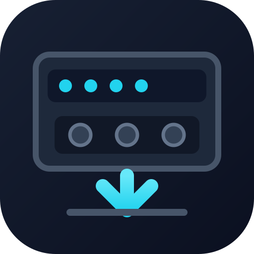
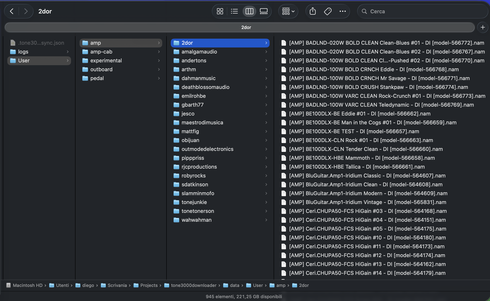

# TONE3000 NAM2 Downloader

<p align="center">
  
</p>

> **Disclaimer:** This is an independent, experimental project. It is not affiliated with, endorsed by, sponsored by, or supported by TONE3000 or tone3000.com.

> **API use:** This utility uses the official TONE3000 API to retrieve tone metadata and download NAM A2 models. It does not scrape the tone3000.com website or parse its web pages.

> **🇮🇹 Uso delle API:** Questa utility utilizza le API ufficiali di TONE3000 per recuperare i metadati dei tone e scaricare i modelli NAM A2. Non effettua scraping del sito tone3000.com né analizza le sue pagine web.

## Why this exists

tone3000.com now hosts tens of thousands of NAM profiles, which is an extraordinary resource but can also be difficult to navigate. Many integrations make this easier for guitarists—for example, direct browsing and previewing from a Headrush pedalboard—but trying hundreds of profiles in a real rig still takes time.
After spending time exploring tone3000.com, I found that some creators are genuine must-haves and publish worthwhile new content regularly. Returning to the website every week to search manually for each creator's additions is tedious, even with the available filters.
This small utility was created to solve that problem. Starting from a curated list of creators, it differentially synchronizes their NAM A2 profiles to a local library: it downloads only new or remotely updated models, instead of downloading everything again. The result is a complete, up-to-date archive for each selected creator, without repeatedly searching the website for new releases.
Modern pedalboards such as Headrush units often have several gigabytes of free storage. Keeping a broad local collection makes it practical to load hundreds of NAM profiles and audition them directly inside a familiar rig, alongside the effects you already use. This project downloads NAM A2 profiles only.

🇮🇹 Oggi tone3000.com ospita decine di migliaia di profili NAM: una risorsa straordinaria, ma non sempre facile da esplorare. Esistono molte integrazioni che semplificano la vita del chitarrista—ad esempio la consultazione e l’ascolto diretto da una pedaliera Headrush—ma provare centinaia di profili nel proprio rig richiede comunque tempo.
Dopo un periodo di esplorazione su tone3000.com, ho capito che alcuni autori sono dei veri *must-have* e pubblicano nuovi contenuti validi con regolarità. Tornare ogni settimana sul portale per cercare manualmente le novità di ciascun autore è però fastidioso, anche usando i filtri disponibili.
Questa piccola utility nasce per risolvere il problema. Partendo da una lista selezionata di autori, sincronizza in modo differenziale i loro profili NAM A2 in una cartella locale: scarica solo i modelli nuovi o aggiornati sul portale, senza dover riscaricare ogni volta l’intero archivio. Si ottiene così una raccolta completa e aggiornata per ogni autore selezionato, senza dover ogni volta cercare manualmente le novità sul sito.
Le pedaliere moderne, come quelle della famiglia Headrush, spesso hanno diversi gigabyte di spazio libero. Mantenere una raccolta locale ampia rende più semplice caricare centinaia di profili NAM e provarli direttamente nel proprio rig, insieme agli effetti che si usano abitualmente. Questo progetto scarica esclusivamente profili NAM A2.

## Run with Docker (recommended)

Install [Docker Desktop](https://www.docker.com/products/docker-desktop/); Node.js is not required on the host.

Tested on macOS with Docker Desktop.

Copy `.env.example` to `.env`, then set `TONE3000_API_KEY` to your tone3000.com secret key. The `.env` file is ignored by Git and contains both the key and the comma-separated `TONE3000_USERS` creator list.

All supported tone3000.com categories are synchronized automatically: `amp`, `amp-cab`, `pedal`, `outboard`, `cab`, `space`, and `experimental`.

## Configure the creators to synchronize

Edit the `TONE3000_USERS` line in `.env`. It is the complete list of TONE3000 creator usernames to keep synchronized, separated by commas:

```dotenv
TONE3000_USERS=2dor,tonejunkie,amalgamaudio
```

Add a username to include a new creator; remove one to stop checking that creator on future runs. Usernames are trimmed and normalized to lowercase before calling the API, so `ToneJunkie` and `tonejunkie` refer to the same account. Keep each username only once.

Removing a username does not delete its previously downloaded files: synchronization is one-way and never removes local models. The `--user` command-line option is useful for a one-off sync of a single creator and does not modify `.env`.

🇮🇹 Modifica la riga `TONE3000_USERS` nel file `.env`: contiene l’elenco completo degli username TONE3000 che vuoi mantenere sincronizzati, separati da virgole. Aggiungi un username per includere un nuovo autore; rimuovilo per non controllarlo più nelle sincronizzazioni future. Gli username vengono ripuliti e convertiti automaticamente in minuscolo prima della chiamata API, quindi `ToneJunkie` e `tonejunkie` indicano lo stesso account. Inserisci ogni username una sola volta.
Rimuovere un username non cancella i file già scaricati: la sincronizzazione è a senso unico e non elimina mai modelli locali. L’opzione `--user` serve per una sincronizzazione occasionale di un singolo autore e non modifica `.env`.

## Archive creators / 🇮🇹 Archiviare autori

Use the optional `ARCHIVED` variable in `.env` for creators whose existing library you want to retain but no longer synchronize:

```dotenv
ARCHIVED=jesco,oldcreator
```

At the start of the next `sync`, every matching creator folder is moved from `data/User/<category>/<creator>/` to `data/Archived/<category>/<creator>/`. The category-and-creator structure is preserved, the manifest is updated, and archived creators are excluded from remote synchronization. Nothing is deleted. If the destination already contains a file with the same name, identical files are deduplicated; different files are preserved and recorded as conflicts in the session log.

Usa la variabile opzionale `ARCHIVED` in `.env` per gli autori di cui vuoi conservare la libreria già scaricata, ma che non vuoi più sincronizzare:

```dotenv
ARCHIVED=jesco,oldcreator
```

All’avvio della successiva `sync`, ogni cartella dell’autore viene spostata da `data/User/<categoria>/<autore>/` a `data/Archived/<categoria>/<autore>/`. La struttura categoria/autore viene mantenuta, il manifest viene aggiornato e gli autori archiviati vengono esclusi dalla sincronizzazione remota. Non viene eliminato alcun file. Se la destinazione contiene già un file con lo stesso nome, i file identici vengono deduplicati; file differenti vengono conservati e registrati come conflitti nel log di sessione.

```sh
cp .env.example .env
./go.sh                                      # synchronize all configured creators in the foreground
./go.sh sync --dry-run                       # preview the changes without writing files
./go.sh status                                # display the local manifest
docker compose run --rm tone3000downloader              # synchronize all configured creators
docker compose run --rm tone3000downloader sync --user 2dor
docker compose run --rm tone3000downloader sync --dry-run
docker compose run --rm tone3000downloader status
```

Downloaded files and the manifest are persisted in the local `data/` folder. Logs also have their own explicit bind mount at `data/logs/`, so they persist even when the temporary `docker compose run --rm` container is removed.

## Obtain a tone3000.com secret key

1. Sign in to your TONE3000 account.
2. Open **Settings**, then **API Keys**.
3. Generate a **Secret Key** (its current format begins with `t3k_cs_`). Copy it immediately and store it securely: TONE3000 treats it as a server-only credential.
4. Put it in `.env` without quotes:

   ```dotenv
   TONE3000_API_KEY=t3k_cs_your-secret-key
   ```

Do not commit, share, or embed this value in an app distributed to other people. If it is exposed, revoke or regenerate it in TONE3000 Settings and update `.env`. TONE3000 also documents OAuth for user-facing integrations; this local downloader uses a single secret key instead.

Official reference: [TONE3000 API documentation](https://www.tone3000.com/api) and [API Terms of Service](https://www.tone3000.com/api/terms).

## Native Node.js usage

Node.js 20 or later is needed only when running the CLI outside Docker. Set `TONE3000_USERS` and `TONE3000_API_KEY` in the environment. Creator usernames are normalized to lowercase automatically before querying the API. The CLI also supports an unversioned `secret.json` containing `apiKey` for backward compatibility.

## Commands

```sh
npm run sync                 # all configured creators
npm run sync -- --user 2dor  # one creator only
npm run sync -- --dry-run    # show actions without writing files
npm run status               # local manifest summary
npm test
```

## File layout

```text
data/User/<category>/<creator>/<model name> [model-<id>].nam
```

`data/User` contains the primary copies. Profiles are organized by category and then creator, without a tone-title intermediate folder. Characters that are incompatible with file names are normalized. IDs keep profiles and models with the same name unique.

For example, a NAM A2 model by `2dor` is stored as:

```text
data/User/amp-cab/2dor/UBER.BLUE Lead [model-694998].nam
```

Example of the resulting folder structure on macOS:



## Synchronization policy

The `data/.tone3000-sync.json` manifest stores the remote version and SHA-256 hash for every written file. File paths are stored relative to `data/`, so the same library works both on the host and inside Docker. The temporary download URL is intentionally not used to decide whether a model changed. The manifest is updated atomically after every completed download or update, so an interrupted run preserves completed progress. Synchronization downloads new or remotely updated models, never deletes local files, and never overwrites a locally modified file; such cases are reported as conflicts. Downloads are written to a temporary file and then atomically renamed.

Before downloads begin, older primary layouts are migrated to the current category-and-creator layout without redownloading the files. This includes removing tone-title intermediate folders and converting legacy filename formats. The migration is recorded atomically in the manifest.

Every `sync` command also creates a text summary in `data/logs/YYYY-mm-DD-HH-MM tone3000downloader.log`. The file records startup, authentication, every model action, errors, and the final summary. If two sessions start within the same minute, the second file receives a numeric suffix to avoid overwriting the previous log.

The CLI uses authenticated TONE3000 endpoints to find each creator's NAM A2 tones, retrieve their A2 model lists, and download models individually. Requests are serialized at roughly 90 per minute to stay within the default API limit. Only models reported by TONE3000 with architecture version `2` are synchronized.
